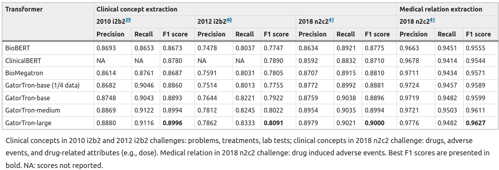

## Requirements for an MVP

- _What agents are needed to answer a research question?_
    - The ideal is within the document, this would allow for maximal separation in goals so that those that require focus (Experimental designer, Monkey, Analyst) can operate without broad knowledge causing distraction. Meanwhile the large scale thinkers (PI, Reporter, Judge, Archivist) will be able to make broader judgments using a broad pool of information. Furthermore the Monkey agents specifically will need to be trained the most carefully so the 
  - _Which of these agents are minimally required to produce a sensible experimental request?_
        - Based on current experiments we may be able to get a single agent to produce both the Research Plan and the Experiments. The same could be said for the Analyst and the Monkey. The Archivist is not needed immediately as it can be handled in the meantime using native functionality of pinecone and langchain for the simple semantic searches. However, as research problems scale in complexity vector databases will be insufficient and there are still the requirements of needing to search the internet for related documentation.
            - Planner, Analyst/Monkey is the MVP but I don't know how well it will perform.
- _What data is needed?_
  - The data required seems to be:
      - Objective
      - Available resources for job
          - Human
          - Equipment
          - Software tools
          - Relevant data already gathered (ie. protein sequence)
      - Documentation for tools
      - Research in the fields
      - Methods database
   
  - _How to access that data?_
      - Manually uploading to the required information into a database that can be queried by the language model in [SQL](https://blog.langchain.dev/llms-and-sql/)
      - Vector databases like [pinecone](https://www.pinecone.io/), [milvus](https://milvus.io/), [Weaviate](https://weaviate.io/), [Vald](https://vald.vdaas.org/), [Qdrant,](https://qdrant.tech/) which is opensource.
      - This can be controlled and extended using [Llamaindex](https://github.com/jerryjliu/llama_index) and [LangChain ](https://python.langchain.com/en/latest/index.html) type tools that have interfaces for creating Agents like what has been described. 
- _What are the API requirements for the CRO’s?_
    - Each [CRO](https://www.biotech-careers.org/company-core-activity/contract-research) has a different set of requirements in order to complete an order, some of these organizations are better set up to integrate. The ability to make API calls is already confirmed through the coming of [Toolformer](https://doi.org/10.48550/arXiv.2302.04761) and open source implementations are already underway such as [here](https://github.com/conceptofmind/toolformer) and [here](https://github.com/lucidrains/toolformer-pytorch). This implies that the only real barrier here would be accessing information on the API’s themselves and integrating them into the Toolformer framework, a task that itself may be well suited to automation.

This is a short list of some places that might be useful to send API
calls for experimental purposes: 
* [HADDOCK](https://github.com/haddocking)
* [ROSETTA](https://www.rosettacommons.org/software/servers#rosetta-at-cloud)
    * [Cyrus Biotechnologies](https://support.cyrusbio.com/api/api/)
* [Alphafold](https://apitracker.io/a/alphafold)
* [Emerald Cloud Labs](https://www.emeraldcloudlab.com/internal-developers-api/)
    * This is an API to handle the data in ECL, but I've sent messages asking if they have an API to request an experiment be run. 
* etc.
I am currently in the process of emailing a number of CRO's to see what the general response to making API calls with an in-house research-management program to run experiments for us. 

Other CRO’s are still accessible via automated email requests. If desired one
may even have the Monkey trawl the internet for academic research labs
doing similar experiments and send emails asking for a collaboration.

What needs to be done is to generate lists of services that can be requested alongside the required formats for such services with associated prices. This may need to be done by hand, although we may be able to leverage CRO's to generate it for us to be included into the network of RoboResearchers.

  - _Can we have the AI scrape the internet for academics to contact about including in the project?_
    - Yes, email drafting is well within the LM's capacity and the ability to search for scientists with the appropriate expertise is covered by prior sections. There are multiple methods that come to mind from [Google Scholar ](https://serpapi.com/google-scholar-api)to [LinkedIn](https://developer.linkedin.com/)

## What other products exist that solve automated research and development?

- _Are non-language model solutions already here? Are language model solutions here?_
    - Automation has been a [hot topic](https://www.frontiersin.org/articles/10.3389/fbioe.2020.571777/full) in Biotech for a long time, however he complexity of experimental design and execution has not been deeply studied. Even recent months focus has been on the applications of LLM's in [biotech](10.1038/s41587-022-01618-2), while others are worried about the usage to [write papers or code snippets](https://www.cureus.com/articles/148413-chatgpt-for-future-medical-and-dental-research#!/). The field is ripe for a tool that can be implemented such that a single research question can have an actionable research plan with minimal human intervention. 

## Which models are appropriate?

- _Which ones are the best match for a given problem?_
    - The [model choice](10.48550/arXiv.2303.18223) is important given the specific problems, some models are trained for different fields such as [medically specific models](10.1038/s41746-022-00742-2). Of these Google's [medPaLM](10.48550/arXiv.2212.13138) has performed well although there are many options available including open source ones. OpenAI is of course an option with GPT 3.5, 4, and the new plugins. The [Wolfram-alpha](https://writings.stephenwolfram.com/2023/03/chatgpt-gets-its-wolfram-superpowers/) plugin is particularly salient to this point, however these models are closed-source making access a matter of allowance and the prices may suddenly change. 
From: A large language model for electronic health records

What is important to note is that a multimodal reasoning must be included for full analysis such as this [MM-COT](https://github.com/amazon-science/mm-cot) that was released. [Llamaindex](https://github.com/jerryjliu/llama_index) and [LangChain](https://python.langchain.com/en/latest/index.html) are both of note here as well and will be a good basis for this tool. What the best choice will probably be is to generate this as model-agnostic while budding off new models we specifically designed for the agents as "suggested Agents". 
