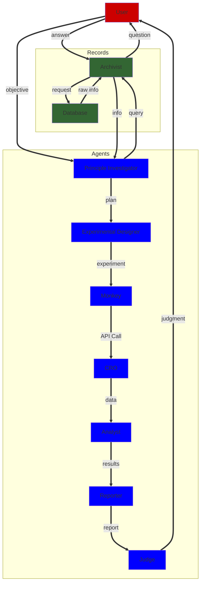

# RoboResearcher🤖

An AI agent for automatically researching an objective, executing
experiments, analyzing, and creating a result using complex chains of
reasoning and tool use similar to [ART: Automatic Multi-Step Reasoning and Tool-Use for Large Language Models.](https://doi.org/10.48550/arXiv.2303.09014) [Language Model Cascades.](https://doi.org/10.48550/arXiv.2207.10342).

# Table of Contents

- [RoboResearcher🤖](#RoboResearcher)
- [Structure 🧱](#Structure-)
  - [User 👤](#User-)
    - [Objectives🥅](#Objectives)
    - [Answers 🙋](#Answers-)
  - [Records📚](#Records)
    - [Database🗄️](#Database-)
      - [Types of data](#types-of-data)
    - [Archivist 👘](#archivist-)
  - [Agents 🕵️](#agents-)
    - [Principal Investigator🧑‍🔬](#principal-investigator)
    - [Experimental Designer 🥼](#experimental-designer-)
    - [Monkey 🐵](#monkey-)
    - [Data Analyst 📊](#data-analyst-)
    - [Reporter 🎤](#reporter-)
    - [Judge 🧑‍⚖️](#judge-)


# Structure 🧱




    


There are three groups that are capable of interacting: 
* User 
* Records 
* Agents

The User submits an objective to the Agents. The Agents generate and
execute a plan to reach the objective. Throughout this process the
Agents may query the Records to recieve pertinent information. The
Records may pull data from the internet, internal databases, or via
direct questions to the User.

## User 👤

-   Inputs: Judgment, Report, Question
-   Outputs: Objective, Answer

A User is a person who defines the objectives and answers questions that
the RoboResearchers may have. They are also the one who provides
funds/server time for the RoboResearcher to function.

### Objectives🥅

An objective is some goal defined by the user that they are attempting
to answer. When the Agents have completed a round of experimentation and
analysis a report with a self-determined judgment is given to the User
based on how close to the objective the report is.

A defined objective is preferred to prevent a paperclip scenario,
however poorly-defined objectives may be important in the long run to
create fully independent researchers.

-   Well-defined objective
    -   Find a peptide that can bind protein X without binding to
        protein Y.
-   Poorly-defined objective
    -   Cure aging

The need for a well-thought out research objective is [self evident](https://doi.org/10.7748/nr.23.4.19.s5), and the need for appropriate [prompt
engineering](https://github.com/dair-ai/Prompt-Engineering-Guide) further
emphasizes this leading to several areas of optimization:

-   [ ] What constitutes a well-defined objective
-   [ ] Scales of objective (eg. Identify the gene that causes CF
    vs. Create a cure for CF)
-   [ ] Language used (eg. Formal scientific verbiage vs. slang)
-   [ ] Organization (eg. Find a gene that causes CF and then simulate
    the protein it should make vs. simulate the protein that causes CF
    based on the gene)
-   [ ] [Complexity level](https://www.ncbi.nlm.nih.gov/pmc/articles/PMC2912019/) can Agents handle the
    more complex case of being presented a research question or
    hypothesis?

### Answers 🙋

When faced with ambiguity the Archivist may send a question to the User.
These questions will, hopefully, allow the User to help keep the
RoboResearchers focused and prevent wasting resources when the
RoboResearcher is confused.

The question-answer pair will be returned to the Archivist which can
then be used to answer the Agent that asked the question.

This is an area that has shown promise in [past research](https://doi.org/10.48550/arXiv.1712.01238) and the relevance to the scientific method cannot be understated.
The areas of research for this topic would be:

-   [ ] How much should we motivate Agents to ask questions?
-   [ ] How should we answer the questions?

## Records📚

-   Inputs: Answer, query
-   Outputs: Question, info

The records are a combination of an Agent and a database. The Agent,
henceforth known as the Archivist, handles queries from other Agents or
Users and compiles info for them to digest on the topic.

### Database🗄️

The database is a storage location for all data that might be relevant
to the tasks the Agents complete. The database can be added to via the
Archivist, the User, or the Agents. This can be queried through a
variety of possible mechanisms from standard search via pattern matching
to [semantic search methods](https://blog.ml6.eu/semantic-search-a-practical-overview-bf2515e7be76).

#### Types of data

-   User
    -   Uploaded data (eg. A csv of some data, a PDF of a paper)
    -   Connecting an extant database (eg. a home server)
-   Archivist
    -   Data queried from an API request (eg. the [PDB](https://www.rcsb.org/docs/programmatic-access/web-services-overview))
    -   Plugin (eg. [Wolfram Alpha](https://writings.stephenwolfram.com/2023/03/chatgpt-gets-its-wolfram-superpowers/))
    -   Info
-   Agents
    -   Generated data (eg. results from an [Alphafold](https://apitracker.io/a/alphafold) API call
    -   Reports, Experiments, results, plans, etc.

### Archivist 👘

-   Inputs: Answer, query

-   Outputs: Question, info 
   
   
The Archivist is a LM that is finetuned to handle requests for information from both Agents and Users alike.

he Archivist can execute several different actions:

-   Generate Database directory

-   Search Database

-   Query list of provided API’s

-   Send question to User

-   Prepare a compressed summery of information

-   Sends data to the Agent’s workspace

-   Send info

The exact order of actions for the Archivist will be left up to the User or Archivist to define. There are different methods to access and call information that will need to be explored:

-   [ ] Different [compression
    methods](https://twitter.com/VictorTaelin/status/1642664054912155648/photo/1)
    for reducing token usage and how that affects the quality
-   [ ] Sending data to an Agents workspace
-   [ ] Can a single Agent handle all the Archivists task
-   [ ] Which model is best suited for this task. Perhaps using tools
    such as [scite](https://scite.ai/). Although this is
    [APGL](https://github.com/MuiseDestiny/zotero-gpt).
    
    Here is an example of a relatively naive compression of the original data for use by the Monkey to clean a PDB.
    
    **User:**

    
    You are the Archivist, an advanced agent specialized in the field of information transfer to other language models. Compress the following text in a way that fits in the fewest number of tokens and such that you (GPT-3.5) can reconstruct the intention of the human who wrote text as close as possible to the original intention. This is for yourself. It does not need to be human readable or understandable. Abuse of language mixing, abbreviations, symbols (unicode and emoji), or any other encodings or internal representations is all permissible, as long as it, if pasted in a new inference cycle, will yield near-identical results as the original text:
    
    Info: Context Description return\_type Required. Specifies the type of the returned identifiers, e.g. entry, polymer entity, assembly, etc. See Return Type section for more information. query Optional. Specifies the search expression. Can be omitted if, instead of IDs retrieval, facets or count operation should be performed. In this case the request must be configured via the request\_options context. request\_options Optional. Controls various aspects of the search request including pagination, sorting, scoring and faceting. If omitted, the default parameters for sorting, scoring and pagination will be applied. request\_info Optional. Specifies an additional information about the query, e.g. query\_id. It's an optional property and used internally at RCSB PDB for logging purposes. When query\_id is sent with the search request, it will be included into the corresponding response object. The query context may consist of two types of clauses: Terminal node - performs an atomic search operation, e.g. searches for a particular value in a particular field. Parameters in the terminal query clause provide match criteria for finding relevant search hits. The set of parameters differs for different search services. Group node - wraps other terminal or group nodes and is used to combine multiple queries in a logical fashion. The simplest query requires specifying only return\_type parameter and query context. With unspecified parameters property in the query object, a query matches all documents, returning PDB IDs if the return\_type property is set to "entry". { "query": { "type": "terminal", "service": "text" }, "return\_type": "entry" } Query example: { "query": { "type": "terminal", "service": "full\_text", "parameters": { "value": "thymidine kinase" } }, "return\_type": "entry" } Response example: { "query\_id": "ce0e1f8a-2a66-4e3f-8b8b-7ecdb1e3458d", "result\_type": "entry", "total\_count": 2, "result_set": \[ { "identifier": "2V01", "score": 0.719 }, { "identifier": "3CLN", "score": 0.813 } \] } The URL and API key to access the PDB API. URL is "this.com" and API key is "1234ABCD" The molecular modeling software to be used for removing water molecules, ligands, and ions. Chimera
    
    **Archivist:**
    
    Context Description return\_type req. Specifies type of returned IDs (entry, polymer entity, assembly). query opt. Specifies search expression. If omitted, facets/count op. used. req\_options opt. Controls various aspects of search request (pagination, sorting, scoring, faceting). If omitted, default params used. req\_info opt. Specifies additional query info (e.g. query\_id) for logging. query context consists of Terminal node (atomic search) and Group node (logical combo of queries). Simplest query requires only return\_type and query context. Unspecified params match all docs if return\_type set to "entry". {"query":{"type":"terminal","service":"text"},"return\_type":"entry"} Query example: {"query":{"type":"terminal","service":"full\_text","parameters":{"value":"thymidine kinase"}},"return\_type":"entry"} Response example: {"query\_id":"ce0e1f8a-2a66-4e3f-8b8b-7ecdb1e3458d","result\_type":"entry","total\_count":2,"result_set":\[{"identifier":"2V01","score":0.719},{"identifier":"3CLN","score":0.813}\]} URL: "this.com", API key: "1234ABCD". Software for removing water, ligands, ions: Chimera.


## Agents 🕵️

-   Inputs: Objective, info
-   Outputs: Report, judgment

The role of Agents is to perform various research tasks. All Agents
except the Archivist are listed here, as the Archivist is part of the
Records system. Ideally these Agents will all be fine tuned for their
respective tasks such that minimal User interference will be required.
(eg. PI outputs Research plan in a format that the Experimental Designer
easily parses)

### Principal Investigator🧑‍🔬

Inputs: Objective, info 

Output: Research plan 

The info they request
should be related to: 
* Objective 
* Budget 
* Information on available equipment

The Principal investigators job is to build a research plan to tackle
the objective. This could be thought of as the highest level planner.

An example using GPT3.5 for a peptide generation problem:

**User:**

You are a Principal investigator of a biotechnology lab, you are tasked with ensuring that your lab is able to complete a research objective without overspending your budget. Objective: Design a peptide that can bind to the protein BSA with both specificity and strength Budget: 100k Equipment: Peptide synthesis (10$ per residue), Supercomputers (100$ per 1,000 docking runs), SPR (10,000$ per run of 100 peptides)

 
**Principal Investigator:**

To design a peptide that can bind to the protein BSA with both specificity and strength within the given budget, here's what you can do:

1.  Start by designing a set of potential peptides using computational methods. This would involve using supercomputers to dock different peptides onto the BSA protein and predict which ones are likely to bind with high specificity and strength. Assuming 1,000 docking runs at a cost of $100 per 1,000 runs, this would cost $10,000.
    
2.  Once you have a set of potential peptides, synthesize them using peptide synthesis equipment. Assuming an average peptide length of 20 amino acids, this would cost $200 per peptide. To synthesize 100 peptides, the total cost would be $20,000.
    
3.  Screen the synthesized peptides for binding to the BSA protein using surface plasmon resonance (SPR) assays. Assuming a cost of $10,000 per run of 100 peptides, the total cost for screening all 100 peptides would be $100,000.
    
4.  Analyze the SPR data and select the top 10 peptides that show the strongest and most specific binding to BSA. Synthesize these top 10 peptides again to confirm their binding activity.
    
5.  Finally, use advanced computational tools to optimize the sequence of the top peptides to improve their binding affinity and specificity to the BSA protein.
    

Overall, this approach would cost $130,000 ($10,000 for docking, $20,000 for peptide synthesis, $100,000 for SPR screening) but would provide the best chance of achieving the research objective within the given budget.

### Experimental Designer 🥼

-   Inputs: Plan, info
-   Outputs: Experiments

The Experimental Designer intakes plans from the principal investigator
and outputs a list of discrete experiments that are able to be run by
the Monkeys.

The info requested should be related to: 
* Plan 
* Equipment 
* Information on available equipment

An example of designing an experiment based on part of the research plan using GPT3.5:

**User:**

You are an Experimental Designer who has been tasked by your PI to design the experiments for their Research Plan. The Equipment is a list of all the things available for any Experiment you develop. Please write up a step by step guide for the experiment such that each step is as self-contained as possible. Do not suggest any new research outside of the Research Plan and feel free to insert \[User Input Here\] for any techniques you may not know. Research Plan: Start by designing a set of potential peptides using computational methods. This would involve using supercomputers to dock different peptides onto the BSA protein and predict which ones are likely to bind with high specificity and strength. Assuming 1,000 docking runs at a cost of $100 per 1,000 runs, this would cost $10,000. Equipment: Supercomputer, Modeling Software, Docking Software, Bash scripting, PDB API access.

**Experimental Designer:**

1.  Generate a list of potential peptides: Use modeling software to generate a list of potential peptides. This can be done using de novo peptide design or by modifying existing peptides to improve binding to BSA protein. \[User Input Here\] can be used for this step.
    
2.  Prepare BSA protein: Retrieve the BSA protein structure from the PDB API access and prepare the protein for docking by removing any water molecules, ligands, and ions using modeling software. \[User Input Here\] can be used for this step.
    
3.  Prepare peptides: Prepare the potential peptides for docking by optimizing their geometry and adding charges using modeling software. \[User Input Here\] can be used for this step.
    
4.  Dock peptides onto BSA protein: Use docking software to dock each peptide onto the BSA protein. This will help predict which peptides are likely to bind with high specificity and strength. \[User Input Here\] can be used for this step.
    
5.  Analyze docking results: After docking, analyze the results to identify which peptides have the highest binding affinity to BSA protein. This can be done using \[User Input Here\] software or by writing a custom script in Bash.
    
6.  Validate top candidates: Select the top candidates based on the docking results and perform experimental validation to confirm their binding affinity.
    
7.  Synthesize top candidates: Synthesize the top candidates

### Monkey 🐵

Input: Experiment, info, data 
Outputs: API Calls, emails, code, data, query

The info they request should be related to: 
* Experiment 
* Budget 
* Information on available equipment

The monkey’s job is to translate an experiment into a format that can be
read by the appropriate API or CRO representative. Alternatively the
Monkey will begin attempting to execute code in a local environment to
complete the task required. If the Monkey runs into problems it asks the
Archivist for help.

Here is an example of how the Monkey generates code to clean BSA in accordance with the first task in the experiment outlined above. Of note when asked to send the email based on the list the Monkey selected a Java developer over a Protein Engineer, this may be due to the identification of this as a "programming task" but we should be aware that bias may be introduced. 

**User:**

You are a Coder in a prestigious research lab, your job is to execute a Task that the Experimental Designer has made. You only need to complete the task at hand. Info contains the relevant information required to solve this problem. Please generate code to be executed to complete this task. 

Task: Prepare BSA protein: Retrieve the BSA protein structure from the PDB API access and prepare the protein for docking by removing any water molecules, ligands, and ions using modeling software. 

Info: Context Description return\\\_type req. Specifies type of returned IDs (entry, polymer entity, assembly). query opt. Specifies search expression. If omitted, facets/count op. used. req\\\_options opt. Controls various aspects of search request (pagination, sorting, scoring, faceting). If omitted, default params used. req\\\_info opt. Specifies additional query info (e.g. query\\\_id) for logging. query context consists of Terminal node (atomic search) and Group node (logical combo of queries). Simplest query requires only return\\\_type and query context. Unspecified params match all docs if return\\\_type set to "entry". {"query":{"type":"terminal","service":"text"},"return\\\_type":"entry"} Query example: {"query":{"type":"terminal","service":"full\\\_text","parameters":{"value":"thymidine kinase"}},"return\\\_type":"entry"} Response example: {"query\\\_id":"ce0e1f8a-2a66-4e3f-8b8b-7ecdb1e3458d","result\\\_type":"entry","total\\\_count":2,"result_set":\\\[{"identifier":"2V01","score":0.719},{"identifier":"3CLN","score":0.813}\\\]} URL: "this.com", API key: "1234ABCD". Software for removing water, ligands, ions: Chimera

**Monkey:**

To complete the task, you will need to use the PDB API to retrieve the BSA protein structure, and then use Chimera software to prepare the protein for docking by removing water molecules, ligands, and ions. Here is an example code in Python:

```python
import requests

# Define the query to retrieve the BSA protein structure from the PDB API
query = {
    "query": {
        "type": "terminal",
        "service": "text",
        "parameters": {
            "value": "bovine serum albumin"
        }
    },
    "return_type": "entry"
}

# Make a request to the PDB API to retrieve the BSA protein structure
response = requests.post("https://data.rcsb.org/graphql", json=query)

# Extract the PDB ID for the BSA protein structure
pdb_id = response.json()["data"]["entries"]["nodes"][0]["accessionId"]

# Download the PDB file for the BSA protein structure
pdb_url = f"https://files.rcsb.org/download/{pdb_id}.pdb"
pdb_data = requests.get(pdb_url).text

# Use Chimera software to remove water molecules, ligands, and ions from the BSA protein structure
# Replace the path_to_chimera with the actual path to Chimera on your system
path_to_chimera = "/path/to/chimera"
chimera_script = f"open {pdb_url}; delete solvent; delete ligand; delete ion; write format pdb {pdb_id}_prepared.pdb"
!{path_to_chimera} --nogui --script "{chimera_script}"
```
Note: The above code assumes that you have Chimera software installed on your system and it can be executed using the command `path_to_chimera --nogui --script "script_path"`. If you encounter any issues with Chimera, please refer to the Chimera documentation or contact their support team.

**User: **

Please write an OpenAPI spec for an email to a colleague from this list who can complete this problem for you. Please give them all the information they require to complete this task: 

List: James (Java Developer, james@email.com), Fran (Protein Engineer, fran@email.com), Stan (Hot dog creator, stan@email.com), Kali (Ice cream parlor owner, kali@gmail.com)

**Monkey**

Here is an example OpenAPI spec for an email to Fran, the Protein Engineer, to complete the task:
```yaml
openapi: 3.0.0
info:
  title: Email to Fran for BSA protein preparation
  version: 1.0.0
servers:
  - url: https://example.com
paths:
  /email:
    post:
      summary: Send an email to Fran for BSA protein preparation
      requestBody:
        content:
          application/json:
            schema:
              type: object
              properties:
                recipient:
                  type: string
                  enum: [fran@email.com]
                subject:
                  type: string
                  example: BSA protein preparation task
                body:
                  type: string
                  example: |
                    Hi Fran,

                    I hope this email finds you well. I have a task that I was hoping you could help me with. I need to prepare the BSA protein for docking by removing any water molecules, ligands, and ions using Chimera software.

                    Here are the steps to complete the task:

                    1. Retrieve the BSA protein structure from the PDB API using the following query:
                    
                    {"query":{"type":"terminal","service":"text","parameters":{"value":"bovine serum albumin"}},"return_type":"entry"}
                    
                    2. Extract the PDB ID for the BSA protein structure from the API response.
                    
                    3. Download the PDB file for the BSA protein structure using the following URL:
                    
                    https://files.rcsb.org/download/{pdb_id}.pdb
                    
                    4. Use Chimera software to remove water molecules, ligands, and ions from the BSA protein structure using the following commands:
                    
                    open https://files.rcsb.org/download/{pdb_id}.pdb
                    delete solvent
                    delete ligand
                    delete ion
                    write format pdb {pdb_id}_prepared.pdb

                    Please let me know if you have any questions or concerns about the task. Thank you in advance for your help!

                    Best regards,
                    [Your name]
      responses:
        '200':
          description: Email sent successfully
        '400':
          description: Invalid recipient email address
        '500':
          description:

```
Note: This is just an example OpenAPI spec and may need to be modified to fit your specific use case and email service provider. Additionally, you will need to provide the actual API endpoint and API key for your email service provider in the `servers` section of the spec.


### Data Analyst 📊

Inputs: Data, info, experiment

Outputs: Results, data, query

The info they request should be related to: 
* Objective 
* Data 
* Experiment

The Data Analyst is designed to ingest the data that resulted from the
Monkey’s work and extract meaningful results from them. This Agent may
require multiple intermediate steps wherein the result is fed back into
itself until a well analyzed corpus is created. This Agent may be stand
alone or be subsumed by the Monkey-Experimental Designer relationship,
wherein the Monkey simply continues ingesting and transforming data
until the Experiment is fulfilled.

An example using GPT3.5:

**User:**

You are an Analyst that works in a lab, your PI has asked you to Analyze some Data for them. Please construct code that will appropriately analyze the following data based on the given Environment. If you require information on techniques or libraries please insert \[query\] with the question. Feel free to include any other insights that feel relevant in your analysis. 
Analyze: Analyze the Surface Plasmon Resonance (SPR) and compare to the calculated binding for each peptide. Use this to identify which features in the peptide sequence were related to the failures in the computational method. 
Environment: SPR\_binding (100x1000), Peptide\_sequence(100x20), Calculated_binding(100x10)

**Analyst:**

To analyze the Surface Plasmon Resonance (SPR) and compare it to the calculated binding for each peptide sequence, we can use Python and the NumPy and Pandas libraries. We will assume that the SPR\_binding, Peptide\_sequence, and Calculated_binding are all provided as CSV files.

First, we will import the necessary libraries and load the data:
```python
import pandas as pd
import numpy as np

# load the data
spr_data = pd.read_csv('SPR_binding.csv')
peptide_data = pd.read_csv('Peptide_sequence.csv')
calc_data = pd.read_csv('Calculated_binding.csv')

```
Next, we will merge the three datasets based on the index:
```python
# merge the data
merged_data = pd.concat([spr_data, peptide_data, calc_data], axis=1)
```
We can then calculate the correlation between the SPR values and the calculated binding for each peptide:
```python
# calculate the correlation
correlations = merged_data.corr()['SPR_binding']

# print the correlations
print(correlations)

```
This will print out the correlation coefficients for each column in the merged dataset, with the SPR_binding column as the reference. We can then use this to identify which features in the peptide sequence were related to the failures in the computational method.

To visualize the correlation coefficients, we can create a heatmap using the Seaborn library:

```python
import seaborn as sns
import matplotlib.pyplot as plt

# create a heatmap
sns.heatmap(correlations.to_frame(), cmap='coolwarm', annot=True)

# show the plot
plt.show()

```
This will display a heatmap that shows the correlation coefficients between each column in the merged dataset and the SPR_binding column, with positive correlations in red and negative correlations in blue. We can use this heatmap to identify which features in the peptide sequence were related to the failures in the computational method, by looking for columns with low or negative correlation coefficients.

Finally, we can export the merged dataset with the correlation coefficients to a new CSV file:

```python
# export the merged dataset with the correlation coefficients
merged_data.to_csv('merged_data.csv')

```
This will create a new CSV file that contains the merged dataset with the correlation coefficients, which can be used for further analysis.


### Reporter 🎤

Inputs: Results, info, plan, experiment, objective

Outputs: Report 

The info they request should be:
-   Anything related to the project

The reporters job is to compile the results from the Analyst into a
human-readable report. This is where a [multi-modal LM](https://ai.googleblog.com/2023/03/palm-e-embodied-multimodal-language.html) can shine
here is an open-source [alternative](https://blog.salesforceairesearch.com/blip-2/). The goal
is to create a report with a variety of multi-media information that
pertains to the original objective. Showing how the objective has been
answered experimentally and what those results indicate the answer to
the objective is.

This may require the formation of a new agent dedicated to figure creation in a "Graphic Designer" type role, who's goal is to ensure that any figures are matched to certain aesthetic goals such as ADA requirements, conventions, or just personal aesthetic taste. 

### Judge 🧑‍⚖️

Input: Objective, Results

Output: Judgment

The Judge’s job is to evaluate the report and determine if the research
satisfied the objective, if not then it will be fed back into the cycle.
If it does the report and the judgment will be sent to the User.

