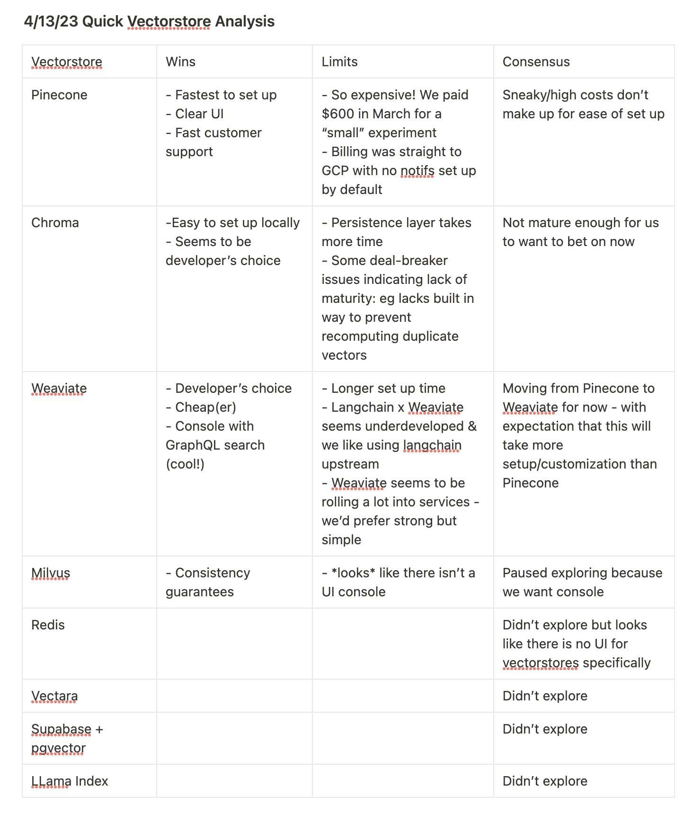

# Feasibility Report
This describes the feasibility and areas that require research to progress. 

## Required Infrastructure for RoboResearchers
1. AI Agents
2. Access to Experimental Platforms
3. Data Storage and Retrieval 
4. User Control

## AI Agents
 The requirements to form an effective AI agent is:
 * Open source language models. There are many with more coming every day.
 * [Fine tune for a task](https://arxiv.org/abs/2104.08691)
 * [Tool use](https://arxiv.org/abs/2302.04761)
 * [Multi-modal Reasoning](https://laion.ai/blog/open-flamingo/)

There are a bevy of open source language models of varying qualities. The ability to make AI agents is expanding every day so any sources that are added here will invariably supplanted within weeks. What is clear is that all the tasks listed in the README are doable by an agent individually with the quality of work being subject to the amount of time and effort one wishes to put into that Agent. 

## Access to Experimental Platforms
The requirements for accessible experimental platforms:

* Programmatic and consistent access to experimental requests 
* Well documented 
* Lists of inputs and outputs from an experiment
* Cost-effective

This section will probably require the most "brute force" man hours in order to connect Agents to the appropriate CRO or server for requests. This could theoretically be automated via an Agent doing enough searching through extant organizations and emailing them pretending to be humans. Emerald cloud labs has the infrastructure already prepared, and more will come. Separate from that there are loads of fully computational platforms for in silico research already well set up for programmatic interaction.

## Data Storage and Retrieval
The requirements for data storage and retrieval are:

 * Vector databases like [pinecone](https://www.pinecone.io/), [milvus](https://milvus.io/), [Weaviate](https://weaviate.io/), [Vald](https://vald.vdaas.org/), and [Qdrant](https://qdrant.tech/).
 * Data search, there are many [methods](https://github.com/currentslab/awesome-vector-search) with [LangChain](https://python.langchain.com/en/latest/index.html) and [Llamaindex](https://github.com/jerryjliu/llama_index) as good candidates for programmatic controls.

A users analysis of some of these [vector databases](https://twitter.com/ashe_cs/status/1646543644038397952?t=wmvlI9x5JZg_FNf2O8QAlg&s=19):

Just like Agent design there are more methods of storing and retrieving information coming out every day.

## User Control
The requirements for user control are:
* Ability to control volume of API requests
* Augment agent interaction graph
* Keep track of what the Agents are doing

Making sure the User always has control of what an Agent is doing and ensuring the Agent doesn't accidentally break laws is important. So ensuring that API calls can be tracked and having the ability to easily trace their actions in real time is vital. 

## Current Examples
The presence of the [synthesis robot language model ](https://arxiv.org/ftp/arxiv/papers/2304/2304.05332.pdf)shows this is a valid methodology and that there is promise. However, based on their social media [posts](https://www.linkedin.com/posts/emerald-therapeutics_science-research-ai-activity-7051798189351309313-tPcb?trk=public_profile_like_view) and lack of any public github repo's I find it unlikely they will open source their code. On top of that this is based on GPT4 which is closed source. I have sent an email asking after this and got an automated response saying he is working on a "time sensitive project"...

# Feasibility

This is feasible and producing a minimal product should be doable by a software engineer familiar with these tools. There is already something similar that has been made in the synthesis robot. Creating software that is user friendly and making more useful Agents will be where a majority of the research would lie. What I would prioritize is creating a framework that treats the Agents, available API's, and Databases as objects that can be swapped out easily. As deeply integrating with any particular model or methodology might just end up wasting time when a week later a new method is released that blows everything prior out of the water. 